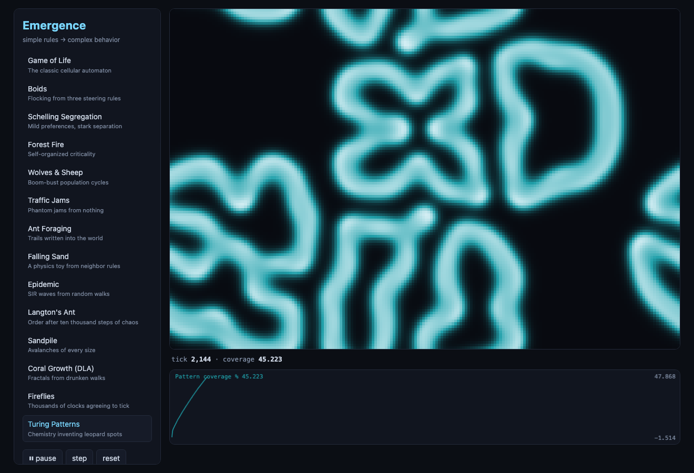
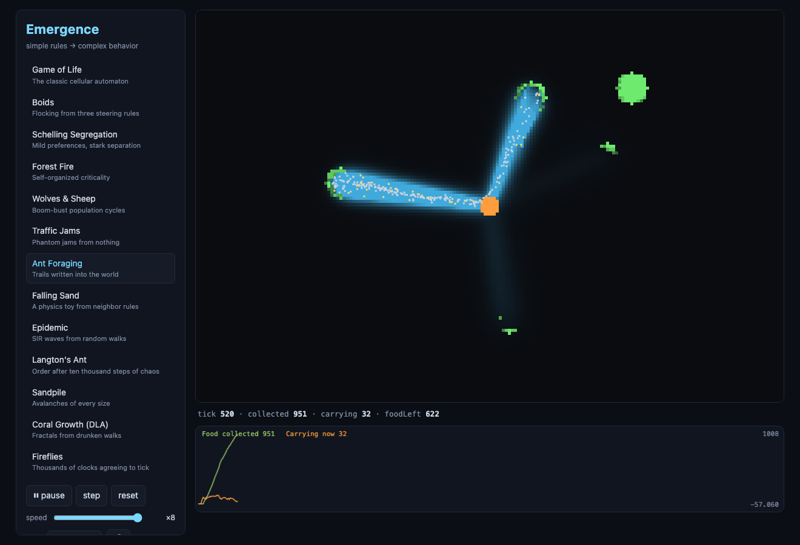

# Emergence

**Tiny worlds. Simple rules. Complex behavior.**



An interactive agent-based modeling playground: the classic emergence simulations, each one a pure-TypeScript state machine with a canvas front end. No frameworks, no runtime dependencies, no build tooling beyond `tsc`. Every run is seeded and exactly reproducible — which is also what makes the test suite honest.

**▶ Live demo: [ahl-gram.github.io/emergence](https://ahl-gram.github.io/emergence/)**

```bash
npm install   # dev deps only: typescript + @types/node
npm start     # build + serve → http://localhost:4173
npm test      # full suite via node:test (176 tests and counting)
```

Keyboard: **space** play/pause · **s** single step · **r** reset. Several sims respond to the mouse (draw cells in Life, drop food for the ants, paint sand/water/walls, start fires).

## The idea

None of these simulations contain the thing they produce.

The flocking code has no concept of a flock — only three steering urges per bird. The segregation model contains no segregationist — only mild individual preferences. The traffic model has no jam scheduler — only drivers reacting to the car ahead. The pattern you see is not written anywhere in the program. It *emerges* from many local interactions, and that gap — between what the rules say and what the system does — is the whole subject.

That makes these little worlds a useful intuition pump for any system of interacting agents: markets, epidemics, neighborhoods, server fleets, and (see below) multi-agent AI systems.

## The models

| Model | The local rule | What emerges |
|---|---|---|
| **Game of Life** | Live with 2–3 neighbors, born with 3 | Gliders, oscillators, stable colonies |
| **Brian's Brain** | Fire on exactly 2 firing neighbors, then rest | A sky permanently full of spaceships |
| **Boids** | Separate, align, cohere with nearby birds | One flock that moves like a single organism |
| **Schelling Segregation** | Move only if <30% of neighbors are like you | Stark segregation nobody asked for |
| **Forest Fire** | Trees sprout; lightning ignites; fire spreads | Self-organized criticality — fires of every size |
| **Wolves & Sheep** | Eat, starve, reproduce | Lotka–Volterra boom-bust population waves |
| **Traffic Jams** | Accelerate, brake, occasionally dawdle | Phantom jams rolling backward through the ring |
| **Ant Foraging** | Drip pheromone homeward; follow strong scent | Trails — colony memory stored in the dirt |
| **Falling Sand** | Sand falls down/diagonal; water also flows sideways | Angle of repose; water finds its level |
| **Epidemic** | Wander; infect neighbors; recover immune | The SIR curve, herd immunity, R₀ threshold |
| **Langton's Ant** | Turn right on dark, left on lit, flip, walk | ~10,000 steps of chaos, then an endless highway |
| **Sandpile** | A cell holding 4 grains topples to its neighbors | Power-law avalanches; a fractal mandala |
| **Coral Growth (DLA)** | Random-walk in; freeze on first touch | Branching fractals from pure probability |
| **Fireflies** | Seeing a flash nudges your clock forward | The whole field pulsing as one heartbeat |
| **Turing Patterns** | Two chemicals react and diffuse | Leopard spots, stripes, endless mitosis |
| **Ising Magnet** | Agree with your neighbors, unless heat flips you | A sharp phase transition at T ≈ 2.27 |
| **Cooperation Wars** | Play Prisoner's Dilemma, copy your best neighbor | Cooperation surviving in fractal clusters |
| **Wealth Condensation** | Wager a slice of the poorer partner's wealth, fair coin | Extreme inequality from perfectly fair rules |
| **Opinion Dynamics** | Compromise only with views near your own | Echo chambers; zealots dragging the middle |
| **Pedestrian Lanes** | Step forward; dodge toward the clearer side | One-way lanes, no choreographer |
| **Gravity Clumps** | Every speck pulls on every other | Galaxy formation in miniature |
| **Percolation** | Random pores; water soaks from the top | An all-or-nothing breakthrough at p ≈ 0.593 |
| **Punctuated Equilibrium** | Replace the weakest species and its neighbors | Bak–Sneppen extinction avalanches; stasis then upheaval |
| **Spiral Waves** | Advance a phase only when a neighbor leads you | Rotating BZ-reaction / heart-tissue spirals |

Each sim's sidebar explains its rule and suggests an experiment (`try:`). The chart below the canvas plots the system's *order parameter* over time — watching polarization climb as a flock forms, or the predator-prey waves chase each other, is half the fun.

## Why this matters for multi-agent AI systems

Agent-based modeling is the older sibling of today's LLM multi-agent patterns, and the lessons transfer directly:

- **Stigmergy (Ant Foraging)** — coordination through a shared medium instead of messages. The colony's knowledge lives in the pheromone field, not in any ant. This is the blackboard/shared-scratchpad pattern: agents that read and write a common artifact (a plan file, a findings doc) coordinate without ever talking to each other — and the artifact, like the pheromone field, needs *evaporation* (staleness pruning) or it accumulates noise.

  
- **Local rules, global failure modes (Schelling, Traffic)** — every agent behaving reasonably does not mean the system behaves reasonably. Individually-sensible retry policies produce thundering herds; individually-mild preferences produce segregated equilibria. When a swarm of worker agents misbehaves, look for the emergent dynamic before blaming any single agent's prompt.
- **Order parameters (Boids' polarization, SIR counts)** — you can't debug a swarm by reading one agent's transcript, just as you can't see a flock in one bird. You need a small number that summarizes the whole: agreement rate between workers, duplication rate across findings, coverage fraction. Instrument the system, not the agent.
- **Criticality (Forest Fire, Sandpile)** — systems that accumulate tension release it in power-law bursts: mostly small cascades, rarely huge ones. Queues, dependency graphs, and agent pipelines with feedback all live near this regime. The absence of large failures for a long time is not evidence they can't happen; it's often evidence fuel is accumulating.
- **Thresholds (Epidemic's R₀)** — spread processes flip sharply at a critical value rather than degrading gracefully. Whether an error (or a meme, or a retry storm) dies out or takes over the fleet depends on whether each instance triggers more or less than one successor.
- **Consensus without a leader (Fireflies)** — agents converge on shared timing purely by nudging toward what they observe locally. Distributed systems use the same trick (gossip protocols, clock sync); so does any agent ensemble that iterates toward agreement instead of electing an arbiter.
- **Bounded confidence (Opinion Dynamics)** — agents that only update on inputs close to their current position fragment into camps that never reconcile. A panel of judge agents that each anchor on their first impression behaves the same way; diversity of starting prompts plus a wide acceptance window is what keeps synthesis possible.

The difference from MultiAgentLab (the sibling project): there, intelligence lives *in* the agents and the structure is orchestrated. Here, the agents are trivially dumb and all the intelligence is *in the interaction*. Real multi-agent LLM systems are both at once — which is exactly why they surprise you.

## Architecture

```
src/
  core/    rng.ts (mulberry32)  grid.ts (typed-array grids)  types.ts (Simulation<S>)  registry.ts
  sims/    one file per model — pure init/step, no DOM
  ui/      app.ts (loop + wiring)  painter.ts (ImageData scaler)  chart.ts  controls.ts
  test/    node:test suites — sims import cleanly into Node because rendering is separate
```

Every simulation implements one interface:

```ts
interface Simulation<S> {
  init(seed: number, p: Params): S;        // pure
  step(state: S, p: Params): S;            // pure — never mutates its input
  render(state: S, ctx, view): void;       // the only DOM-touching code
  stats(state: S, p: Params): Record<string, number>;
  onPointer?(state: S, x, y, buttons, p): S;
  params: ParamSpec[];                     // auto-generates the sidebar controls
  series?: SeriesSpec[];                   // auto-plots on the strip chart
}
```

All randomness flows through a seeded `Rng` whose internal state rides inside the sim state as a plain number (`Rng.fromState(s.rngState)` … `rng.state()`). Same seed, same params ⇒ bit-identical run, in the browser and in Node.

## Adding your own world

1. Copy the shape of `src/sims/life.ts` (the smallest one).
2. Keep `init`/`step` pure; build new typed arrays, return new state.
3. Register it in `src/core/registry.ts`.
4. Add `src/test/<name>.test.ts` with at least: a determinism test, a no-mutation test, and **one behavioral invariant** — the thing that must be true if your rule is right (conservation of agents, a quantity that must rise, an impossible state that must never appear).
5. `npm test`, then `npm start` and watch it run.

Good candidates: Vicsek model, Wa-Tor, majority-rule voting, Bak–Sneppen evolution, firefly-style synchronized clapping with spatial sound delay. (Fireflies, Turing patterns, and Brian's Brain were once on this list — they became worlds 13–15.)

## Testing philosophy

Determinism turns behavior into something you can assert:

- *Invariants* — matter conserved in a sealed sandbox; S+I+R constant; cars never collide; every DLA particle attached to an earlier one.
- *Behavior* — polarization rises above 0.7; similarity climbs past 0.62; a full forest burns down completely; the ecosystem sustains 600+ steps.
- *Golden values* — Langton's ant flips exactly 834 cells in 11,000 steps, every time, forever.

None of these are flaky, because nothing is random at test time — randomness is a parameter, not an environment.

---

Built autonomously by Claude (Fable 5), starting 2026-06-12. Zero runtime dependencies; the only things `npm install` fetches are the TypeScript compiler and Node type stubs.
